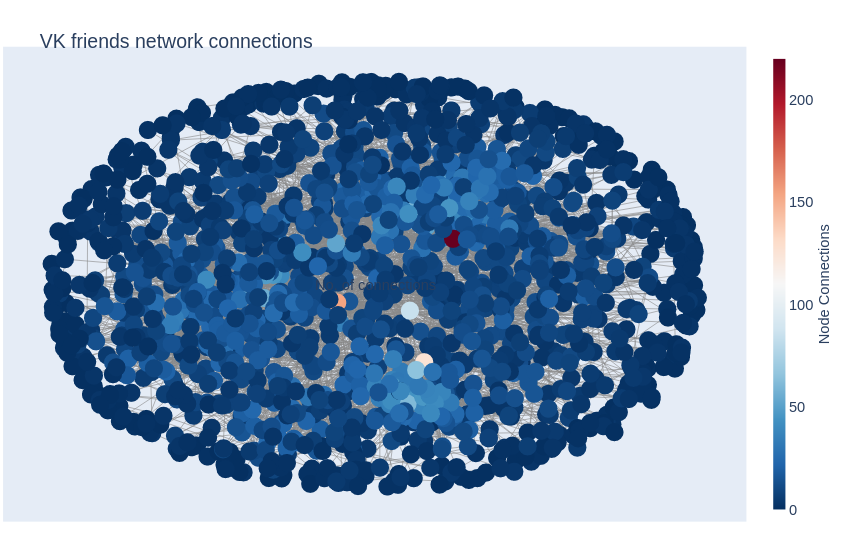

# Лабораторная работа 2

## Задание
- Собрать информацию о друзьях в vk
- Оценить центральность: по посредничеству, по близости, собственного вектора

## Данные
ID студентов группы в сети vk

## Ход работы
Для работы с api сети vk выбрана одноименная библиотека.

Используя методы api `friends.get` и `users.get` скачиваем необходимые данные о студентах и строим граф через библиотеку `networkx`, сам граф сериализуем в формат `gpickle`

Визуализация графа выполнена через интерактивную библиотеку `plotly`, которая генерирует web страничку `vk_connections.html` по входным данным.

На основе графа считаем метрики центральности:
- Closeness centrality (центральность по близости)
- Eigenvector centrality (центральность собственного вектора)
- Betweenness centrality (центральность по посредничеству)

