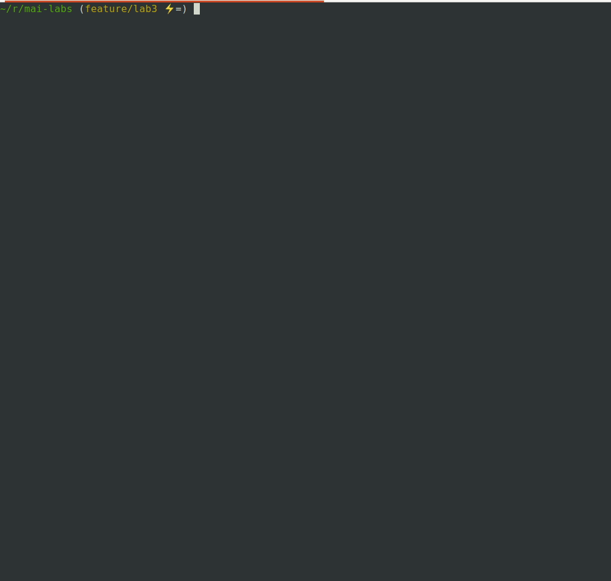
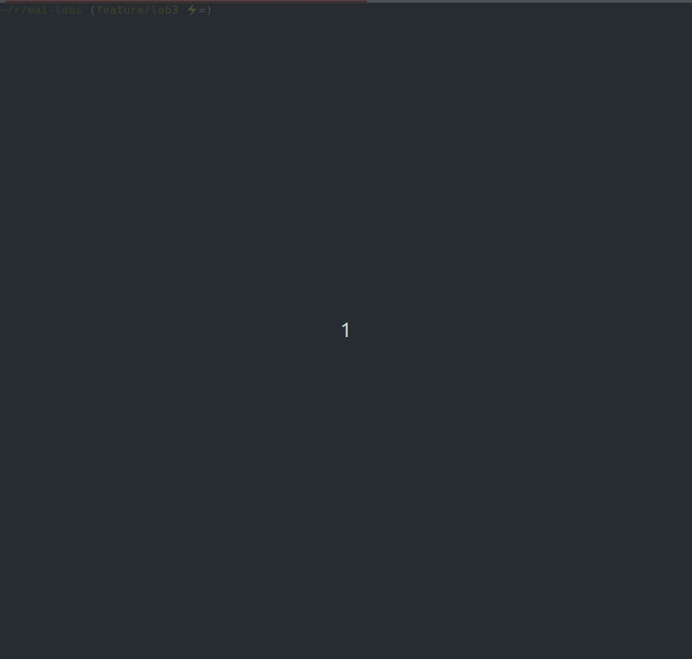
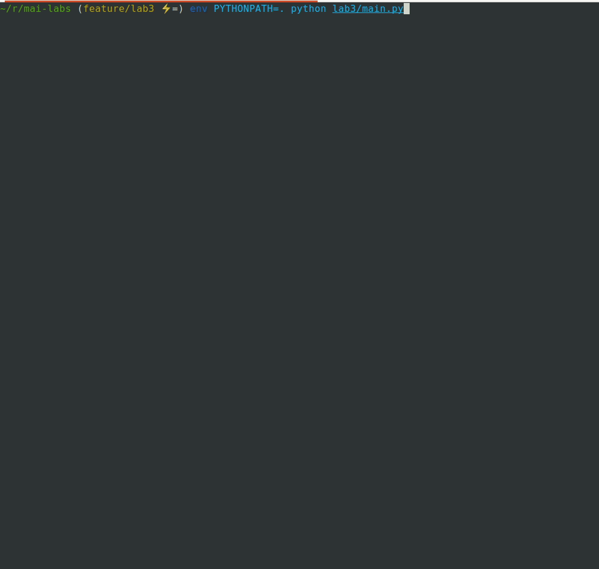

# Лабораторная работа 3

## Задание
Реализовать модель Шеллинга (модель расовой сегрегации)

## Данные
Входные данные по умолчанию: 
Дан квадрат `NxN`. 45% клеток синие, 45% клеток красные, 10% клеток пустые. Начальное заполнение в случайном порядке.

## Ход работы
Используя библиотеку `numpy` реализовали модель Шеллинга, а также класс визуализирующий поведение модели в терминале

Результаты запуска программы на разные параметрах:
- 2 расы, 35% красной, 35% зелёной, "Хорошая клетка" - 2 соседа

- 2 расы, 35% красной, 35% зелёной, "Хорошая клетка" - 4 соседа

- 4 расы, 15% красной, 20% зелёной, 10% желтой, 10% синей, "Хорошая клетка" - 2 соседа

- 4 расы, 15% красной, 20% зелёной, 10% желтой, 10% синей, "Хорошая клетка" - 3 соседа

