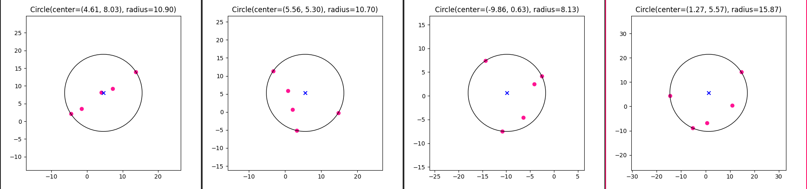
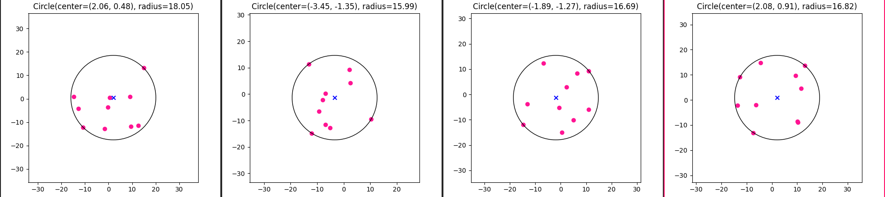
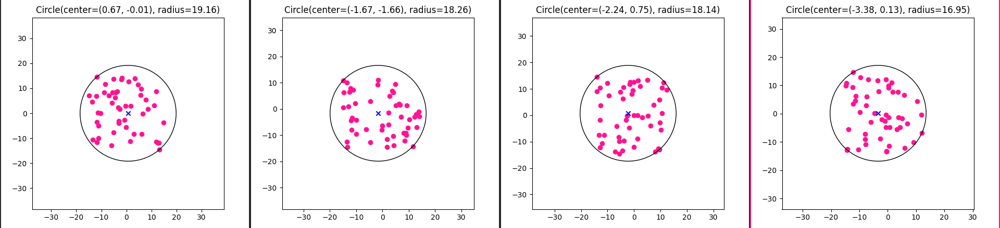
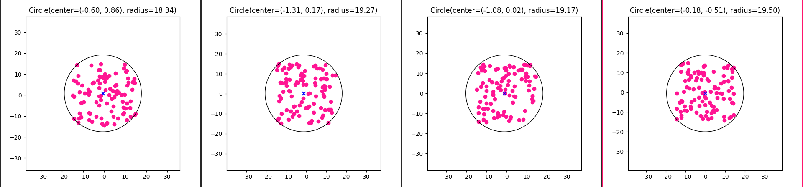
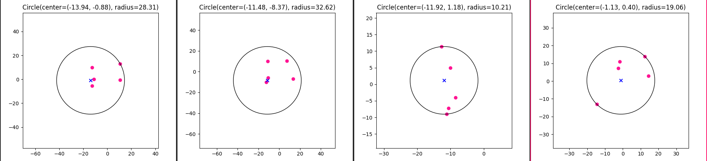
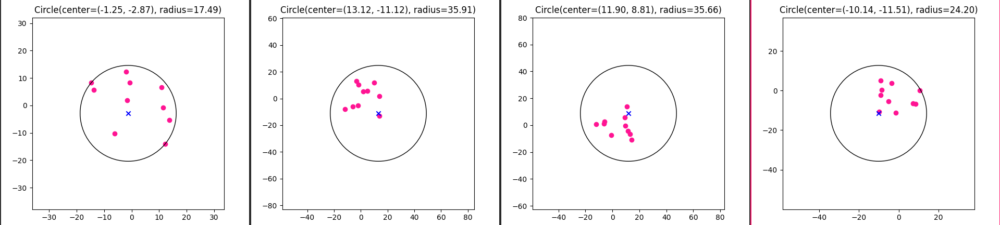
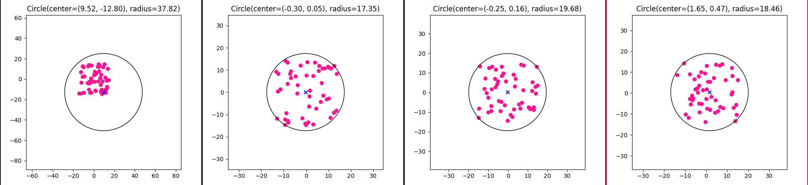
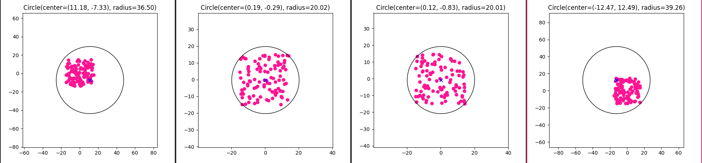

# Лабораторная работа 4


## Задание
Найти окружность минимального радиуса, которой принадлежат все заданные точки.

## Данные
На вход подаются `n` точек на плоскости в виде координат `x` и `y`

## Ход работы
Реализовали структуры программы: `Point`, `Circle`, два алгоритма и визуализация:
- [Минимальная охватывающая окружность множества точек (enclosing)](https://neerc.ifmo.ru/wiki/index.php?title=%D0%9C%D0%B8%D0%BD%D0%B8%D0%BC%D0%B0%D0%BB%D1%8C%D0%BD%D0%B0%D1%8F_%D0%BE%D1%85%D0%B2%D0%B0%D1%82%D1%8B%D0%B2%D0%B0%D1%8E%D1%89%D0%B0%D1%8F_%D0%BE%D0%BA%D1%80%D1%83%D0%B6%D0%BD%D0%BE%D1%81%D1%82%D1%8C_%D0%BC%D0%BD%D0%BE%D0%B6%D0%B5%D1%81%D1%82%D0%B2%D0%B0_%D1%82%D0%BE%D1%87%D0%B5%D0%BA) 
- [Ограничивающая сфера (ritter)](https://ru.wikipedia.org/wiki/%D0%9E%D0%B3%D1%80%D0%B0%D0%BD%D0%B8%D1%87%D0%B8%D0%B2%D0%B0%D1%8E%D1%89%D0%B0%D1%8F_%D1%81%D1%84%D0%B5%D1%80%D0%B0)


Исходные данные генерируются случайно, количество точек задает параметр `-n` или можно считать точки из файла через параметр `-f`, пример файла `example.txt`
```
usage: main.py [-h] [-f FILE] [-n NUMBER_OF_POINTS] [-s SEED] [-a ALGORITHM]

Find smallest circle

optional arguments:
  -h, --help            show this help message and exit
  -f FILE, --file FILE  Path to file with points coordinates in comma
                        separated style
  -n NUMBER_OF_POINTS, --number_of_points NUMBER_OF_POINTS
                        Number of generated points
  -s SEED, --seed SEED  Seed for random points generation, by default without
                        fixed seed
  -a ALGORITHM, --algorithm ALGORITHM
                        Algorithm for finding smallest circle [enclosing, ritter]
```
Результаты запуска программы:

### Алгоритм `smallest enclosing disctance`
- 5 исходных точек

- 10 исходных точек

- 50 исходных точек

- 100 исходных точек



### Алгоритм `ritter bounding sphere`
- 5 исходных точек

- 10 исходных точек

- 50 исходных точек

- 100 исходных точек



Сравнение алгоритмов:
- `ritter bounding sphere` работает быстрее, но имеет большую погрешность 5-20%
- `smallest enclosing disctance` - точный алгоритм, однако при большом количестве точек работает медленно

Время работы, среднее из 100 запусков, без учета построения графика и генерации точек

| number_of_points    | ritter bounding sphere, s | smallest enclosing disctance, s |
|-------|-----------------------|----------------------|
| 10    | 0.00038 | 0.00131 |
| 100   | 0.00363 | 0.01458 |
| 1000  | 0.03608 | 0.11883 |
| 10000 | 0.36203 | 1.03687 |
