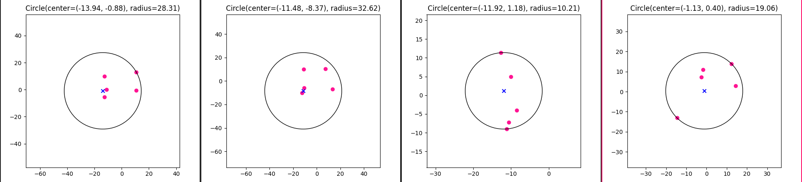
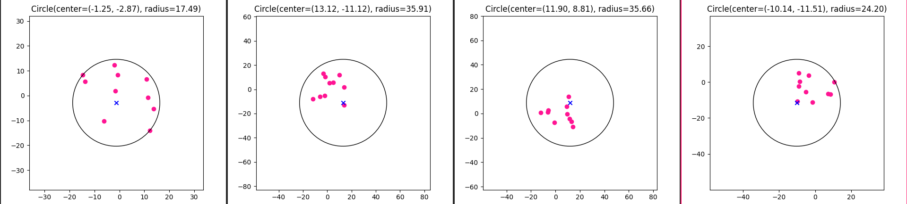
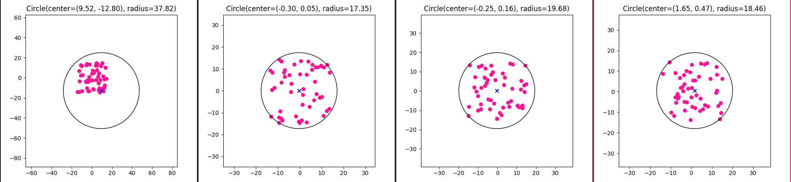
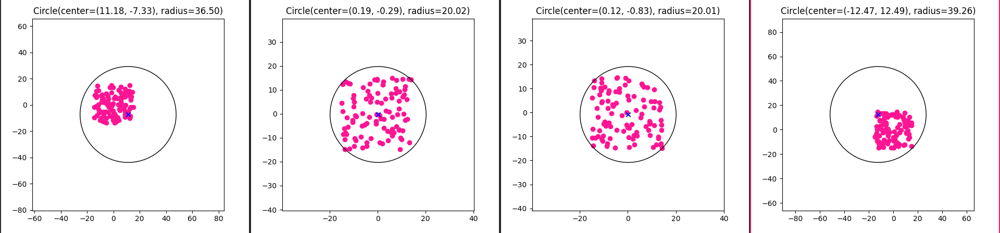

# Лабораторная работа 4

## Задание
Найти окружность минимального радиуса, которой принадлежат все заданные точки.

## Данные
На вход подаются `n` точек на плоскости в виде координат `x` и `y`

## Ход работы
Реализовали структуры программы: `Point` и `Circle`. \
Реализовали алгоритм [минимальной охватывающей окружности множества точек](https://neerc.ifmo.ru/wiki/index.php?title=%D0%9C%D0%B8%D0%BD%D0%B8%D0%BC%D0%B0%D0%BB%D1%8C%D0%BD%D0%B0%D1%8F_%D0%BE%D1%85%D0%B2%D0%B0%D1%82%D1%8B%D0%B2%D0%B0%D1%8E%D1%89%D0%B0%D1%8F_%D0%BE%D0%BA%D1%80%D1%83%D0%B6%D0%BD%D0%BE%D1%81%D1%82%D1%8C_%D0%BC%D0%BD%D0%BE%D0%B6%D0%B5%D1%81%D1%82%D0%B2%D0%B0_%D1%82%D0%BE%D1%87%D0%B5%D0%BA) 
и визуализацию работы алгоритма. \
Исходные данные генерируются случайно количество точек задает параметр `-n` или можно считать точки из файла через параметр `-f`

Результаты запуска программы:
- 5 исходных точек

- 10 исходных точек

- 50 исходных точек

- 100 исходных точек

