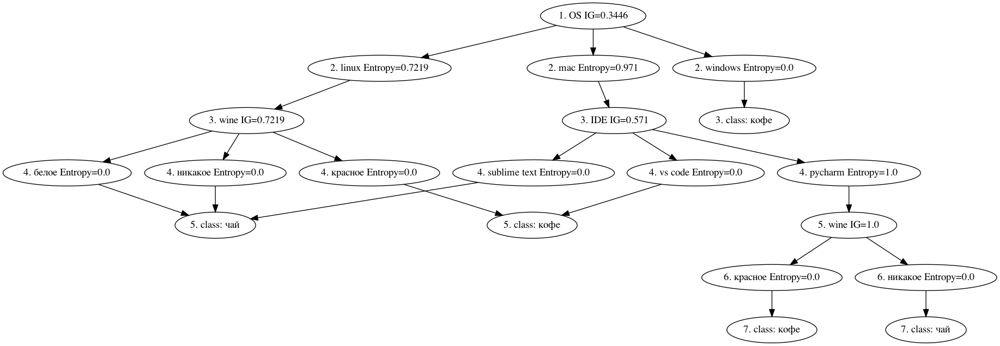
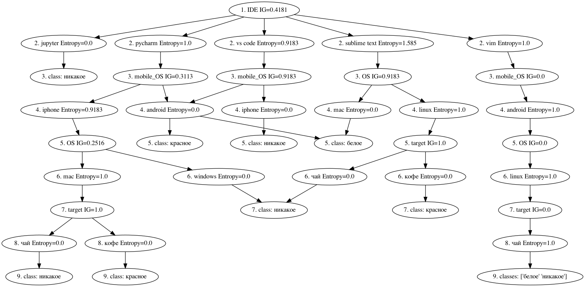
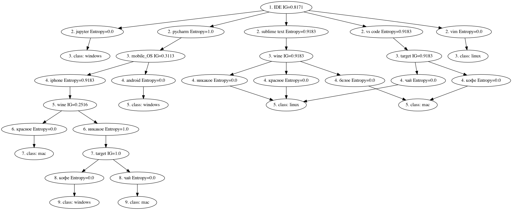

# Лабораторная работа 5


## Задание
Реализация алгоритма ID3

## Данные
CSV датасет опроса предпочтений группы. Целевая переменная - кофе/чай

```
usage: ip3.py [target]
```

## Результаты запуска программы:

### Целевая - чай/кофе



### Целевая - вино



### Целевая - OS



