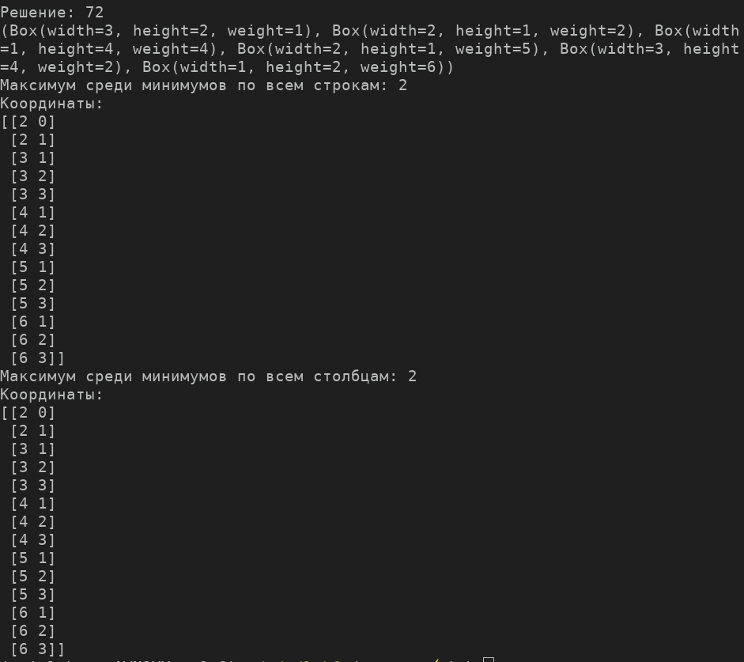

# Лабораторная работа 6

## Задание
Дан пустой двухмерный массив `A` размера `NxM` и список двухмерных массивов, где `n<N` и `m<M`, со значением цены.\
Необходимо написать алгоритм упаковки маленький массивов в `A`, при условии максимизации цены.\
Посчитать метрики

## Ход работы
Реализован следующий алгоритм:
1. Из списка двухмерных массивов перебираем все подмножества - кандидаты решения задачи
2. Сортируем кандидатов по цене, если общая площадь кандидата больше вместимости `A`, то откидываем
3. Проверяем для каждого кандидата можно ли его поместить в массив `A`, использую kd-tree подобный алгоритм\
[Описание алгоритма](https://blackpawn.com/texts/lightmaps/)\

## Пример работы:
### Найдено решение

### Вывод метрик

